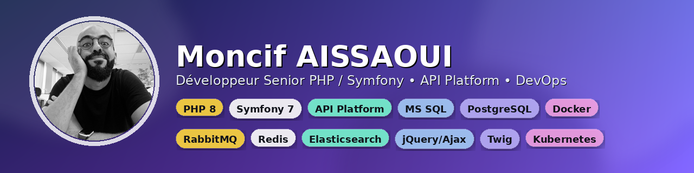

  

  <b>Senior PHP/Symfony</b> • production web products • SQL performance • APIs • CyberArk/PSM integrations

# Moncif Aissaoui

Développeur PHP / Symfony senior  
APIs • Performance • Applications métier • CyberArk / PSM

---

## Ce que je fais

Je développe des applications web faites pour tourner en production, pas juste pour fonctionner en démo.

Je travaille principalement sur :

- des applications métier (CRM, outils internes, workflows)
- des APIs et des intégrations
- des systèmes avec beaucoup de données
- l’amélioration et la maintenance de code existant

---

## Ma manière de travailler

Je me concentre sur ce qui compte vraiment une fois le projet en ligne :

- du code clair plutôt que “malin”
- la performance (requêtes, index, pagination, cache)
- des APIs lisibles et prévisibles
- du code qu’on peut relire facilement dans 6 mois

Je ne cherche pas à impressionner avec de l’architecture.  
Je cherche à construire des systèmes qui tiennent dans le temps.

---

## Les sujets sur lesquels j’interviens souvent

- E-commerce (checkout, fiabilité, performance)
- CRM / outils métier (rôles, workflows, exports, recherche)
- applications RH (processus, validation, reporting)
- applications à fort trafic (latence, stabilité, optimisation SQL)

---

## Focus actuel — CyberArk / PSM

Je travaille sur des outils applicatifs autour de la gestion des accès privilégiés :

- intégrations API et authentification
- collecte de données (Symfony Command, Messenger, Scheduler)
- gestion des accès (safes, ACL, audit)
- recherche optimisée multi-critères (MS SQL)

---

## Comment je travaille

- itérations courtes et maîtrisées  
- évolutions sécurisées sur des projets existants  
- visibilité sur ce qui se passe (logs, suivi, compréhension)  
- optimisation quand c’est réellement utile  

---

## Projets

Dans ce dépôt, on trouve notamment :

- un portfolio Symfony reconstruit proprement  
- une série tutorielle open source (Symfony + API Platform + React)  
- des implémentations inspirées de cas réels  

---

## Contact

Paris  
https://www.lemoncef.fr  
https://www.linkedin.com/in/moncifaissaoui/

